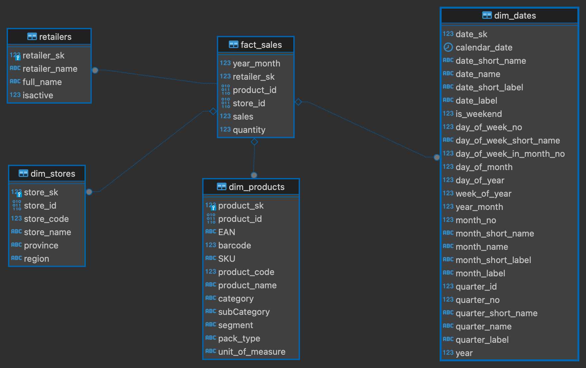

#Data Modeling with PySpark and SQL Server
##Overview
This project focuses on using PySpark to process and transform data from CSV and Excel files, which are then loaded into a SQL Server database. The project is structured to run locally, with scripts for reading and writing data, SQL scripts for setting up database tables and views, and additional resources like an ER diagram and an Azure SQL database template.

##Project Structure
* `Jupyter Notebooks`: These notebooks contain PySpark scripts to read data from CSV and Excel files, process the data, and write it to a SQL Server database.
* `SQL Scripts`: These scripts are used to create tables and views in the SQL Server database.
* `Azure SQL Database Template`: A template for setting up an Azure SQL database.
* `ER Diagram`: A visual representation of the database schema.

##Notebooks Overview

---
1. Reading Excel Files:
- - The function read_excel_file(spark, file_path, sheet_name=None, sheet_index=0) reads an Excel file from a specified sheet name or index using PySpark.
- - The function read_all_excel_files(spark, directory_path, sheet_name=None, sheet_index=0) reads all Excel files from a directory and merges them into a single DataFrame.
2. Reading CSV Files:

- - The function read_csv_file(spark, file_path, delimiter=",") reads a CSV file with a specified delimiter.
- - The function read_csv_large_file(spark, file_path, delimiter=",") handles large CSV files with options like recursive file lookup and malformed data handling.
3. Column Renaming:

- - The function rename_columns(df) replaces spaces and special characters in column names with underscores for consistency and compatibility.

4. Writing Data to SQL Server:

- - The function write_to_sql(spark, spark_df, host_url, tb_name, user, pw) writes a Spark DataFrame to a SQL Server database using JDBC. It handles large datasets efficiently by partitioning the data and using batch inserts.
---
##SQL Scripts
* Table and View Creation: The SQL scripts in this project are used to create the necessary tables and views in the SQL Server database. These scripts should be run in sequence to ensure the database schema is set up correctly.

##Azure SQL Database Template
Setup: This template provides a starting point for deploying your database on Azure SQL. It includes the necessary configurations and parameters to align with the project’s requirements.

##ER Diagram
Database Schema: The ER diagram (.png file) visually represents the database schema, showing the relationships between different tables and views.

##Setup Instructions
####Prerequisites
- Python 3.x
- Apache Spark (PySpark)
- Jupyter Notebook (Lab)
- SQL Server (Local or Azure SQL Database)

## Usage

1. Clone the repository:

```
https://github.com/professorshabs/data_modeling.git
cd data_modeling
```

2. Install the required dependencies:

```
pip install -r requirements.txt
```

3. Start jupyter lab:

```
jupyter lab
```